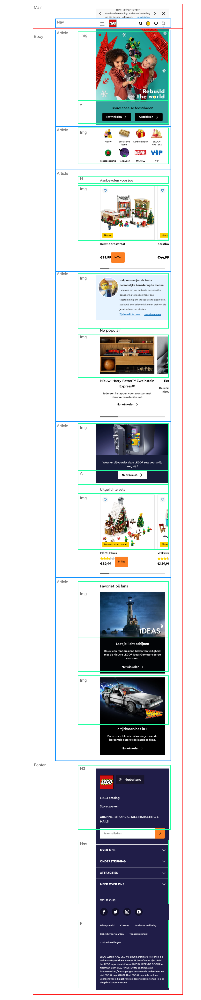
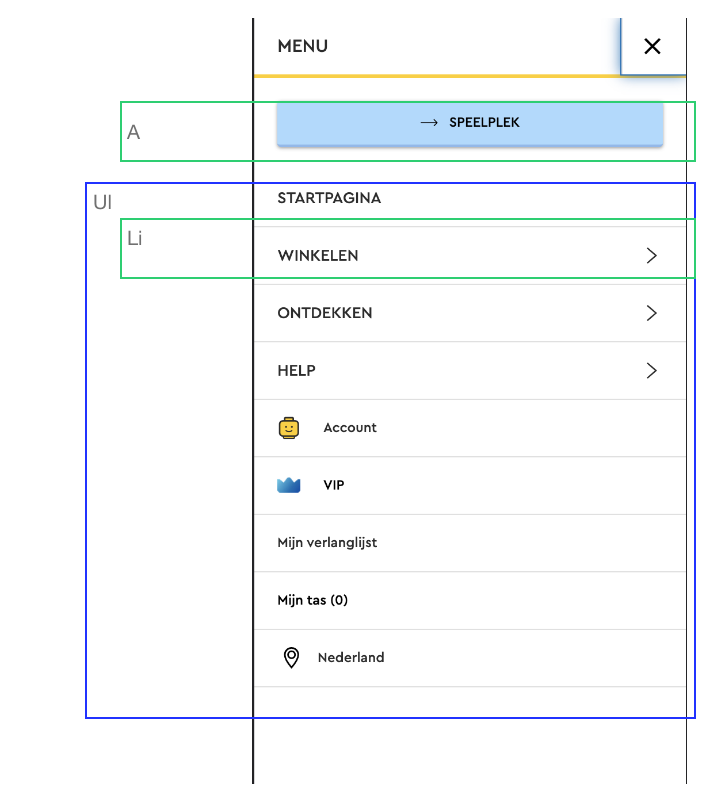
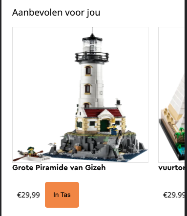
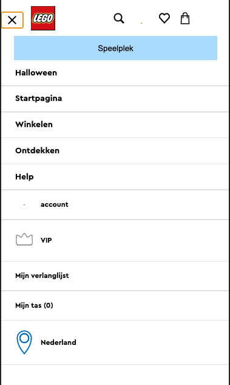

# Procesverslag
Markdown is een simpele manier om HTML te schrijven.  
Markdown cheat cheet: [Hulp bij het schrijven van Markdown](https://github.com/adam-p/markdown-here/wiki/Markdown-Cheatsheet).

Nb. De standaardstructuur en de spartaanse opmaak van de README.md zijn helemaal prima. Het gaat om de inhoud van je procesverslag. Besteedt de tijd voor pracht en praal aan je website.

Nb. Door *open* toe te voegen aan een *details* element kun je deze standaard open zetten. Fijn om dat steeds voor de relevante stuk(ken) te doen.

## Jij

  
uitwerken voor kick-off werkgroep

  ### Auteur:
  Vince van Schagen

  #### Je startniveau:
  Mijn startpunt is de blauwe piste
  #### Je focus:
  Ik leg mijn focus op de surface plane, en ik wil het proberen ietwat responsive te maken

## Je website

  
uitwerken voor kick-off werkgroep

  ### Je opdracht:
  https://vincevanschagen.github.io/FED-LegoSite/
  #### Screenshot(s) van de eerste pagina (small screen): 
  
  Lego Home pagina  
  
  #### Screenshot(s) van de tweede pagina (small screen):
  hier de naam van de pagina  
  
 

## Toegankelijkheidstest 1/2 (week 1)

  
uitwerken na test in 1e werkgroep

  ### Bevindingen

  #### Screenreader
  De screenreader werkte zoals je zou verwachten, alleen plaatjes werden volledig uitgespeld. 
  Dit valt te fixen door een alt tekst te plaatsen.

  #### Muis en Toetsenbord 
  De site was redelijk goed te navigeren met tab, maar op een gegeven moment liep hij vast.
  In de hoorcollege werd verteld dat dit op te lossen was door een invsible link te plaatsen. 

  #### Motoriek (shocks, elastiekjes)
  Ik zette de schok op maximale sterkte en me arm vloog bijna uit de kom en dat was niet te doen.
  Als oplossing voor navigeren mete Parkingson zou ik zeggen dat je de buttons een stuk groter zou kunnen maken.

  #### Visueel (brillen, contrast, kleurenblind, dark/light). 
  Ik deed een test met een bril met loslatende retina. Dit laat zo een groot deel van je visie weg dat hier niet mee valt te werken. 

## Breakdownschets (week 1)

  
uitwerken na afloop 2e werkgroep

  ### de hele pagina: 
  
  

  ### dynamisch deel (bijv menu): 
  

  ### wellicht nog een dynamisch deel (bijv filter): 
  

## Voortgang 1 (week 2)

  
uitwerken voor 1e voortgang

  ### Stand van zaken
  Ik kwam er niet uit hoe ik ervoor zorgte dat een image slider buiten de pagina doorging en wist ook niet zo goed hoe ik dit moest opzoeken. De oplossing hiervoor bleek simpel te zijn: Overflow-x: auto; toevoegen aan de grid waarin alle afbeeldingen stonden.
  
	

  ### Agenda voor meeting
  samen met je groepje opstellen

  | student 1      | student 2          | student 3    | student 4        |
  | ---            | ---                | ---          | ---              |
  | dit bespreken  | en dit             | en ik dit    | en dan ik dat    |
  | en dat ook nog | dit als er tijd is | nog een punt | dit wil ik zeker |
  | ...            | ...                | ...          | ...              |

  ### Verslag van meeting
  hier na afloop snel de uitkomsten van de meeting vastleggen

-Overflow X auto
(Afbeeldingen buiten site)
-Scrollsnap
(balk) (Webkit-Scrollbar)
-Gebruik sections-articles 

  - punt 1
  - punt 2
  - nog een punt
  - ...

## Voortgang 2 (week 3)

  
uitwerken voor 2e voortgang

  ### Stand van zaken
  Ik had soms moeite met het postitioneren van elementen. Ook wist ik niet goed wanneer ik flexbox en wanneer ik grid moest gebruiken. Deze vragen kreeg ik antwoord op tijdens de feedback.

  ### Agenda voor meeting
  samen met je groepje opstellen

  | student 1      | student 2          | student 3    | student 4        |
  | ---            | ---                | ---          | ---              |
  | dit bespreken  | en dit             | en ik dit    | en dan ik dat    |
  | en dat ook nog | dit als er tijd is | nog een punt | dit wil ik zeker |
  | ...            | ...                | ...          | ...              |

  ### Verslag van meeting
  hier na afloop snel de uitkomsten van de meeting vastleggen

  - punt 1
  - punt 2
  - nog een punt
- ...

## Toegankelijkheidstest 2/2 (week 4)

  
uitwerken na test in 8e werkgroep

  ### Bevindingen
  Lijst met je bevindingen die in de test naar voren kwamen (geef ook aan wat er verbeterd is):

  #### Screenreader
  Tijdens het navigeren door de site heen schoot ik van het hamburger menu door naar de section. De p tag werd niet uitgesproken. sommige images hadden geen alt tag dus werden de images volledig uitgesproken.
  Om dit op te lossen heb ik duidelijkere tags gebruikt (H1, H2, H3 etc hierachie) en de images een alt tag gegeven. 

  #### Muis en Toetsenbord 
  Als ik met tab navigeerde door de pagina heen, ging hij van het menu naar de 2e section. Daarna ging hij alle buttons af en sprong hij weer van section naar section
  Dit kan ik oplossen door buttons neer te zetten of invisble tags, hierdoor kun je beter door de site heen navigeren.

  #### Motoriek (shocks, elastiekjes)
  Het navigeren door de site heen met een slechte motoriek was niet verbeterd in opzicht van de orginele site.   
  <!>
  Om dit op te lossen zou je de buttons extreem groot moeten maken.

  #### Visueel (brillen, contrast, kleurenblind, dark/light). 
  Voor deze test had ik een extensie voor chrome gedownload. 
  Uit deze test bleek dat de site erg kleurenblind vriendelijk is Het contrast is dusdanig sterk dat geeneen gebruiker met een soort kleurenblindheid niet zou kunnen navigeren door de website en de informatie lezen. 

## Voortgang 3 (week 4)

  
uitwerken voor 3e voortgang

  ### Stand van zaken
Ik had moeite met de header sticky maken en responsive te houden. Ook liep ik vast met een goed hamburger menu (zonder het gebruik van classes) te maken.
 

  ### Agenda voor meeting
  samen met je groepje opstellen

  | student 1      | student 2          | student 3    | student 4        |
  | ---            | ---                | ---          | ---              |
  | dit bespreken  | en dit             | en ik dit    | en dan ik dat    |
  | en dat ook nog | dit als er tijd is | nog een punt | dit wil ik zeker |
  | ...            | ...                | ...          | ...              |

  ### Verslag van meeting
  hier na afloop snel de uitkomsten van de meeting vastleggen

  - punt 1
  - punt 2
  - nog een punt
  - ...

## Eindgesprek (week 5)

  
uitwerken voor eindgesprek

  ### Je uitkomst - karakteristiek screenshots:
  

  ### Dit ging goed/Heb ik geleerd: 
  Korte omschrijving met plaatjes

  

  ### Dit was lastig/Is niet gelukt:
  Korte omschrijving met plaatjes

  

## Bronnenlijst

  
continu bijhouden terwijl je werkt

  Nb. Wees specifiek ('css-tricks' als bron is bijv. niet specifiek genoeg).

  1. bron 1
  2. bron 2
  3. ...

